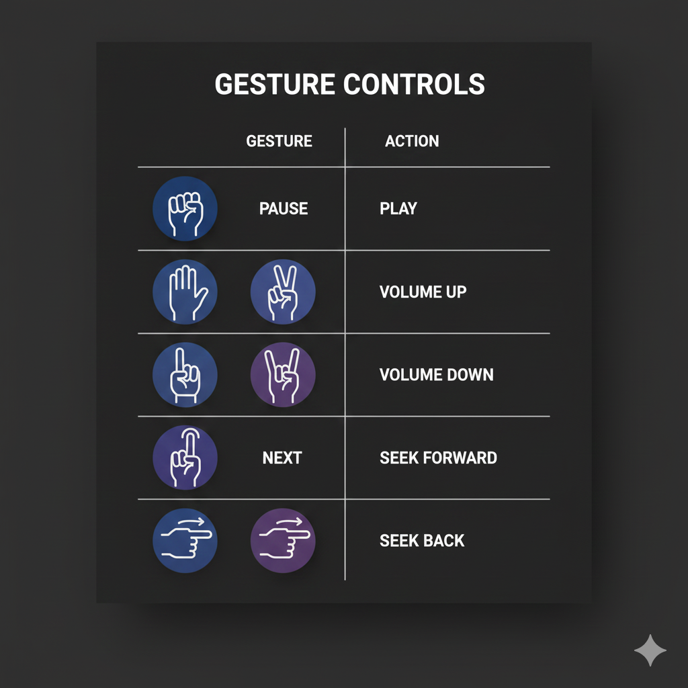

📌 AirPointer — AI Hand Gesture YouTube Controller

Transform the way you watch YouTube using AI-powered hand gestures.
Built with MediaPipe + OpenCV + PyAutoGUI, AirPointer lets you control YouTube touch-free — play, pause, adjust volume, skip videos, seek forward/backward, and more.

     

 🚀 Features

✔ Real-time hand tracking (MediaPipe)
✔ Low-latency gesture detection
✔ Auto-opens YouTube on launch
✔ Play / Pause (fist / open palm)
✔ Volume Up/Down
✔ Next / Previous video
✔ Swipe gestures → Seek forward/back
✔ Thumb Up/Down gestures → Volume control
✔ Fist hold → Mute toggle
✔ Fullscreen toggle
✔ Works on Windows, macOS, Linux

🎥 Demo

🖐️ Gesture Controls
Gesture	Action
✊ Fist	Pause
🖐️ All fingers up	Play
✌️ Index + Middle	Volume Up
🤘 Ring + Pinky	Volume Down
🤙 Pinky only	Next Video
👍 Thumb Up	Volume Up
👎 Thumb Down	Volume Down
✊ (Hold 0.6s)	Mute / Unmute
👉 Swipe Right	Seek Forward (10s)
👈 Swipe Left	Seek Back (10s)
F key (manual)	Fullscreen

🛠️ Tech Stack

Python 3.10+

OpenCV → video processing

MediaPipe Hands → gesture recognition

PyAutoGUI → simulate keyboard actions

NumPy → math utilities

📦 Installation
1️⃣ Clone the repository
git clone https://github.com/charishmasai99/airpointer.git
cd airpointer

2️⃣ Install dependencies
pip install opencv-python mediapipe numpy pyautogui

3️⃣ Run the application

python airpointer_youtube.py

⚙️ Project Structure
AirPointer/
│── airpointer_youtube.py      # Main application
│── README.md                   # Project documentation
│── .gitignore                  # Ignored files
│── assets/                     # Images, demos, optional
└── LICENSE           

📌 How It Works
The system uses a lightweight MediaPipe model to detect:

Finger positions

Landmark coordinates

Movement direction

Then these signals are converted into gesture actions mapped to YouTube’s built-in keyboard shortcuts.

📈 Performance Optimizations

✔ Processes reduced-size video frame for faster inference
✔ Low model complexity = instant response
✔ Lightweight gesture logic
✔ Cooldowns to prevent multiple triggers

🛡️ Requirements

Windows / macOS / Linux

Python 3.10 or above

Webcam

Stable lighting for good detection

📜 License

MIT License
You are free to use, modify, and distribute.

🙌 Contributing

Pull requests are welcome!
If you want to add:

New gestures

Web UI

Hand-detection improvements

Voice prompts

Feel free to open an issue.

⭐ Support

If you like this project, consider giving it a ⭐ on GitHub — it helps a lot!